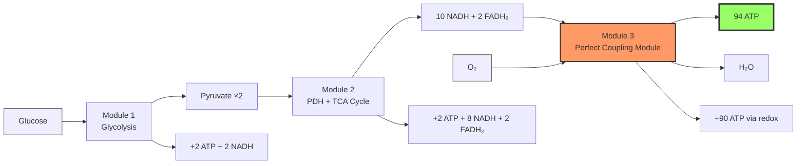
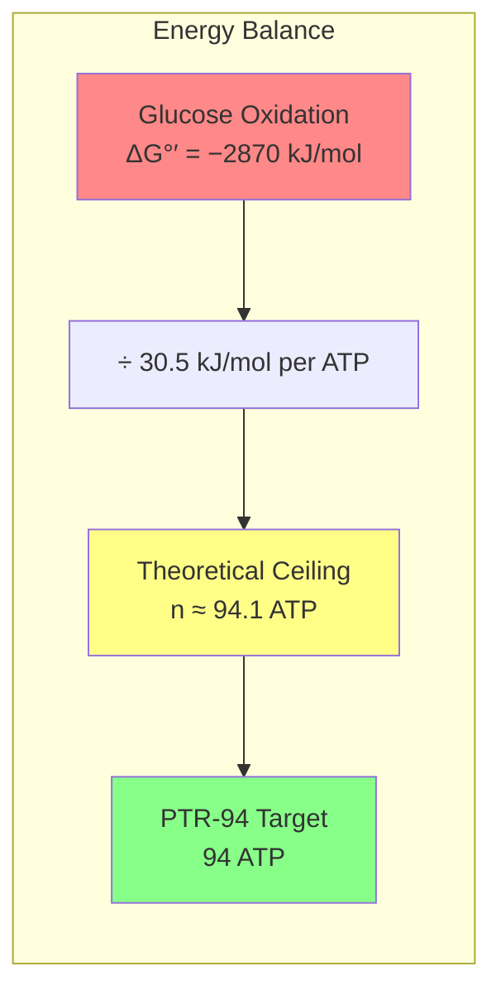
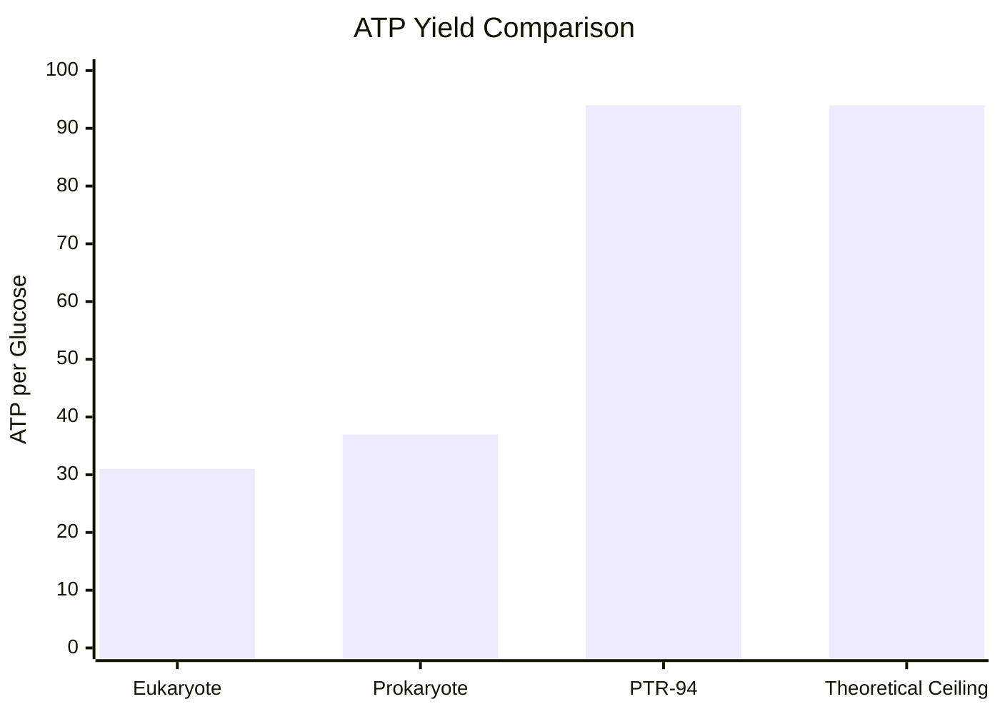
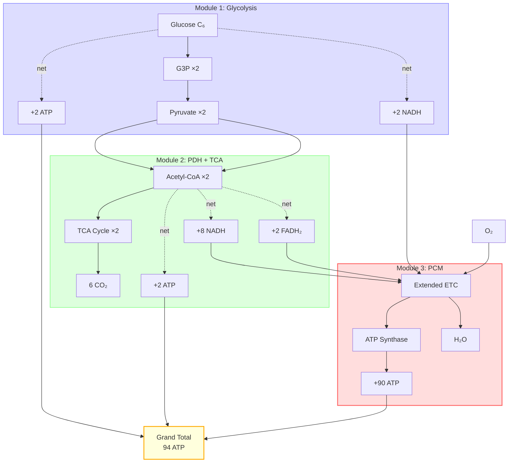
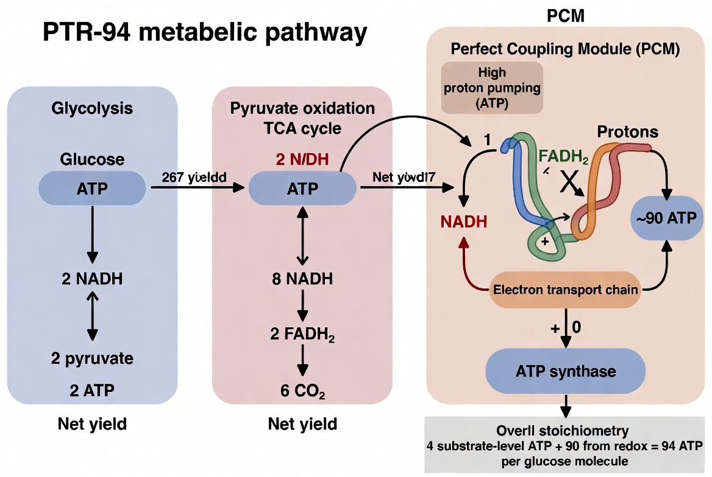
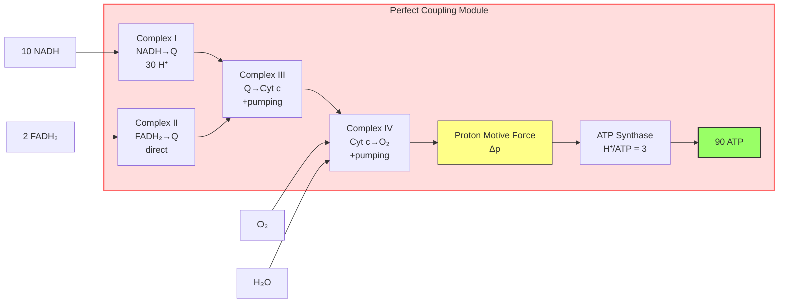
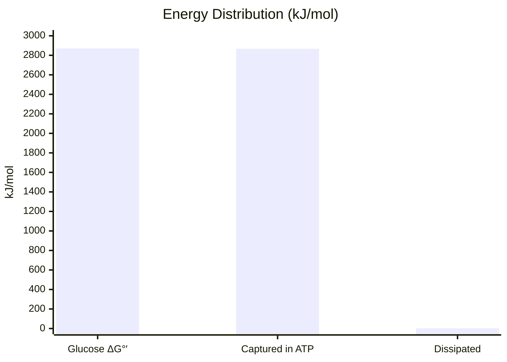
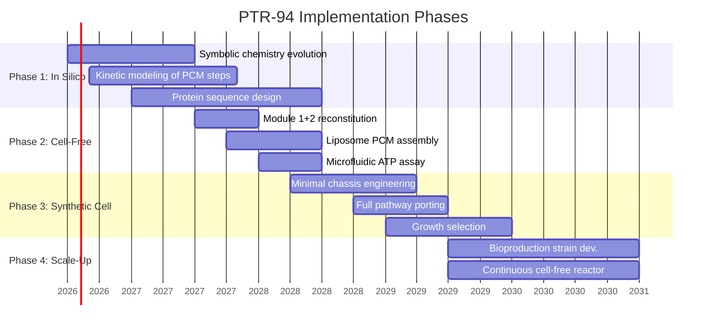
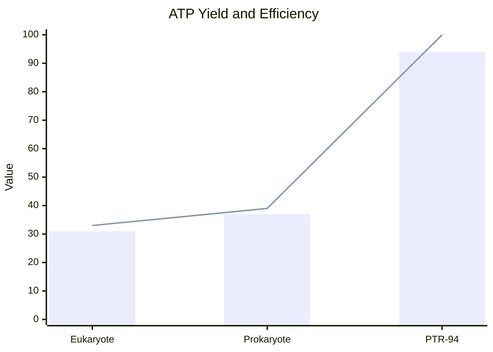

# PTR-94: Perfect Thermodynamic Respiration: Achieving the Theoretical Maximum of 94 ATP per Glucose

[](https://github.com/NullLabTests/PTR-94)
[](https://github.com/NullLabTests/PTR-94)
[](https://github.com/NullLabTests/PTR-94)
[](https://opensource.org/licenses/MIT)
[](docs/paper.tex)

> **A rigorously designed hypothetical metabolic pathway that captures the full thermodynamic free energy of glucose oxidation (~2870 kJ/mol) into 94 ATP molecules per glucose under standard biochemical conditions — the theoretical maximum.**

This repository contains the complete conceptual design, thermodynamic analysis, stoichiometric tables, mechanistic blueprint, and implementation roadmap for **PTR-94** (Perfect Thermodynamic Respiration targeting 94 ATP). It is intended as a target for synthetic biology, de novo protein design, cell-free systems, and in silico evolution experiments in artificial life and symbolic chemistry frameworks.

---

## Abstract

Natural aerobic respiration yields ~30–38 ATP per glucose molecule, representing ~32–40% thermodynamic efficiency relative to the free energy available from complete oxidation of glucose to CO₂ and H₂O. The theoretical ceiling, calculated from ΔG°′ values, is approximately **94 ATP** per glucose if coupling were 100% efficient.

**PTR-94** retains the elegant, stepwise carbon-oxidation chemistry of glycolysis + pyruvate dehydrogenase + TCA cycle (proven, controlled energy release) while replacing natural oxidative phosphorylation with a **Perfect Coupling Module (PCM)** engineered for near-100% efficiency. The design is modular, evolvable, and directly testable in synthetic or cell-free systems.

**Overall target reaction:**

```math
\mathrm{C_6H_{12}O_6 + 6\ O_2 + 94\ ADP + 94\ P_i \longrightarrow 6\ CO_2 + 6\ H_2O + 94\ ATP}
```

(ΔG balanced at standard biochemical conditions.)

---

## Quick-Start Energy Flow



---

## Thermodynamic Foundation



### Energy released by glucose oxidation
```math
\Delta G^{\circ\prime} \approx -2870\ \text{kJ/mol}
```

### Energy cost of ATP synthesis (standard biochemical)
```math
\Delta G^{\circ\prime} \approx +30.5\ \text{kJ/mol}
```

**Theoretical maximum ATP yield:**
```math
n_{\max} = \frac{2870}{30.5} \approx 94.1
```

Under more realistic *physiological* cellular conditions (ΔG ≈ −50 to −60 kJ/mol for ATP), the ceiling drops to ~48–57 ATP. PTR-94 targets the **standard-condition theoretical maximum** as the ultimate engineering goal.

Real biology achieves only ~32–40% of this limit due to:

| Limitation | Impact |
|------------|--------|
| Fixed proton-pumping stoichiometry | ~10 H⁺ per NADH (vs ~30 required) |
| H⁺/ATP ratio ≈ 4 (including transport) | Further reduces yield per proton |
| Proton leaks and slippage | 5–20% efficiency loss |
| Compartmentalization and shuttle costs | 2–4 ATP equivalent overhead |



---

## Pathway Architecture

PTR-94 consists of three modules. Modules 1 and 2 are **standard, well-characterized biochemistry**. Module 3 is the novel engineered component.



### Module 1: Glycolysis (Embden–Meyerhof–Parnas)
**Location:** Cytosol (or equivalent compartment)  
**Net (per glucose):**
```math
\mathrm{Glucose + 2\ NAD^+ + 2\ ADP + 2\ P_i \longrightarrow 2\ Pyruvate + 2\ NADH + 2\ ATP + 2\ H_2O + 2\ H^+}
```

**Contribution:** +2 ATP (substrate-level) + 2 NADH

### Module 2: Pyruvate Oxidation + TCA Cycle
**Location:** Mitochondrial matrix analog  
**Net contributions (per glucose):**
- Pyruvate dehydrogenase (×2): 2 NADH + 2 Acetyl-CoA + 2 CO₂
- TCA cycle (×2): 2 ATP (via GTP) + 6 NADH + 2 FADH₂ + 4 CO₂

**Cumulative after Modules 1+2:**
- **Substrate-level ATP:** 4
- **Reducing equivalents:** 10 NADH + 2 FADH₂
- **Complete oxidation:** 6 CO₂ released

### Module 3: Perfect Coupling Module (PCM) — Core Innovation
The PCM is a hypothetical multi-subunit membrane (or artificial compartmental) super-complex that converts the redox energy of all reducing equivalents into **90 ATP** with near-100% efficiency.

**Design goals for the PCM:**
- Oxidize all 10 NADH + 2 FADH₂ using O₂ as terminal acceptor.
- Extract the *maximum thermodynamically allowed work* per 2e⁻ transferred.
- Two complementary implementation strategies (can be hybridized):

  **A. Ultra-High-Stoichiometry Chemiosmotic Architecture**
  - ~30 H⁺ translocated per NADH (vs natural ~10)
  - Achieved via extended redox chains, multi-proton quinone analogs, and additional proton-pumping modules.
  - Optimized ATP synthase with ideal H⁺/ATP = 3 and direct substrate channeling (eliminates transport overhead).

  **B. Direct Redox-Driven Phosphorylation**
  - Redox-induced conformational changes directly form high-energy phospho-intermediates.
  - Phosphate transferred to ADP with minimal slippage (inspired by classical substrate-level mechanisms but applied at ETC scale).
  - Reduces losses inherent in delocalized proton gradients.

**Stoichiometry Summary Table**

| Process | Substrate-level ATP | NADH | FADH₂ | ATP from PCM (redox) | Total ATP |
|:--------|:-------------------:|:----:|:-----:|:--------------------:|:---------:|
| Glycolysis | +2 | 2 | 0 | +15 | **17** |
| PDH + TCA | +2 | 8 | 2 | +75 | **77** |
| **Grand Total** | **+4** | **10** | **2** | **+90** | **94** |

(Average effective yield in PCM: ~7.5–8 ATP per NADH equivalent.)

---

## Visual Overview



*Figure 1: Conceptual schematic of the PTR-94 pathway. Glycolysis and TCA modules (standard) feed reducing equivalents into the engineered Perfect Coupling Module (PCM) for maximal ATP synthesis.*

---

## Mechanistic Blueprint for the PCM

### Required molecular features (targets for de novo design / directed evolution)
- Extended NADH:ubiquinone oxidoreductase super-complex with 8–10 additional transmembrane proton channels.
- Engineered quinone analogs or multi-proton lipid carriers.
- Rotary ATP synthase variant with minimized rotary slip and H⁺/ATP stoichiometry tuned to 3.
- Scaffolding proteins to form a metabolon (direct channeling of NADH/FADH₂ into the PCM).
- Optional synthetic redox mediators with higher proton-coupling ratios.

### Cofactors
Retain biological NAD⁺/NADH, FAD/FADH₂, and quinone/cytochrome analogs, or introduce designed high-efficiency variants.

### PCM Architecture Diagram



---

## Energy Balance Verification



- Total free energy available from glucose oxidation: **−2870 kJ/mol**
- Energy stored in 94 ATP (standard ΔG°′): 94 × 30.5 ≈ **2867 kJ/mol**
- **Theoretical coupling efficiency:** >99.9%
- Energy dissipated per glucose: **~3 kJ/mol** (entropic cost only)

All exergonic steps in Modules 1–2 release energy in manageable packets. Module 3 is engineered so its driving force exactly balances the synthesis of 90 ATP.

---

## Feasibility, Challenges & Implementation Roadmap

### High-level feasibility
Modules 1 and 2 already exist in nature and are extensively characterized. The PCM is the primary engineering challenge but is within the reach of current synthetic biology, protein design (AlphaFold + RFdiffusion), and cell-free reconstitution technologies.

### Implementation Roadmap



### Key challenges
| Challenge | Severity | Mitigation |
|-----------|----------|------------|
| High proton stoichiometry instability | High | Directed evolution + RFdiffusion stabilization |
| Reactive oxygen species | High | Engineered antioxidant modules |
| Thermodynamic reversal at high [ATP]/[ADP] | Medium | Irreversible reaction steps, kinetic barriers |
| Membrane integrity under high Δp | Medium | Synthetic lipid adaptations |
| In vivo toxicity / metabolic burden | Medium | Inducible expression, chassis engineering |

### Recommended implementation path
1. **In silico modeling & evolution** — Seed symbolic chemistry or ALife reaction networks with glycolysis + TCA + candidate PCM reaction rules. Apply selection pressure for ATP yield / growth efficiency. Many runs will rediscover or improve upon chemiosmotic coupling motifs.
2. **Cell-free prototyping** — Reconstitute purified enzymes of Modules 1+2 + artificial liposomes or nanodiscs containing the PCM in a continuous-flow microfluidic bioreactor. Measure ATP yield directly (luciferase assay or HPLC).
3. **Minimal synthetic cell** — Port the full PTR-94 set into a minimized bacterial chassis (e.g., JCVI-syn3.0 derivatives) with engineered membranes.
4. **Industrial scale-up** — Deploy in high-yield bioproduction strains or cell-free systems where glucose-to-product conversion efficiency is economically critical.

---

## Comparison to Natural Respiration

| Metric | Eukaryote | Prokaryote | PTR-94 |
|:-------|:---------:|:----------:|:------:|
| ATP per glucose | 30–32 | 36–38 | **94** |
| Redox-derived ATP | ~28–30 | ~34 | **90** |
| Thermodynamic efficiency | ~32–34% | ~37–40% | **~100%** |
| H⁺ pumped per NADH | ~10 | ~10 | **~30** |
| H⁺/ATP ratio | ~3.7 | ~3.3 | **3.0** |
| Proton leakage | Significant | Moderate | **Minimized** |
| Primary bottleneck | Biological machinery | Biological machinery | **Engineering** |



---

## Repository Contents

| Path | Description |
|------|-------------|
| `README.md` | This document — full conceptual design |
| `LICENSE` | MIT License |
| `diagrams/PTR-94-schematic.jpg` | Conceptual overview figure |
| `simulation/stoichiometry_verification.py` | Verified ATP stoichiometry and thermodynamic balance |
| `simulation/requirements.txt` | Python dependencies |
| `docs/paper.tex` | LaTeX manuscript draft (arXiv-style format) |

---

## How to Cite

If you use or build upon this concept, please cite this repository:

```bibtex
@software{PTR94_2026,
  title        = {{PTR-94}: Perfect Thermodynamic Respiration -- Achieving the
                  Theoretical Maximum of 94 {ATP} per Glucose},
  author       = {{The PTR-94 Conceptual Design Collective}},
  year         = {2026},
  month        = jun,
  publisher    = {GitHub},
  url          = {https://github.com/NullLabTests/PTR-94}
}
```

---

## Contributing & Future Work

This is a **living conceptual target**. Contributions are welcome in:
- Detailed kinetic/thermodynamic modeling of individual PCM steps
- Protein sequence designs or mutation proposals for high-stoichiometry complexes
- In silico evolution experiments demonstrating emergence of high-yield coupling
- Experimental protocols for cell-free reconstitution
- Extensions to alternative electron acceptors or hybrid photo-redox systems

Open an issue or pull request. All contributors will be credited.

---

## Acknowledgments & Context

This design emerged from discussions on bioenergetic limits, synthetic metabolism, and the interface between thermodynamics and evolvable biochemical networks. It is intended to serve as a concrete, ambitious target for researchers working at the intersection of synthetic biology, artificial life, and origins-of-metabolism studies.

**Status:** Purely hypothetical / conceptual. No experimental validation yet. Thermodynamics are rigorously grounded; mechanistic details are engineering targets.

---

**Repository maintained by the PTR-94 conceptual design collective.**  
Last updated: 2026-06-30

> *"The theoretical maximum is not a limit to be accepted, but a target to be engineered."*
